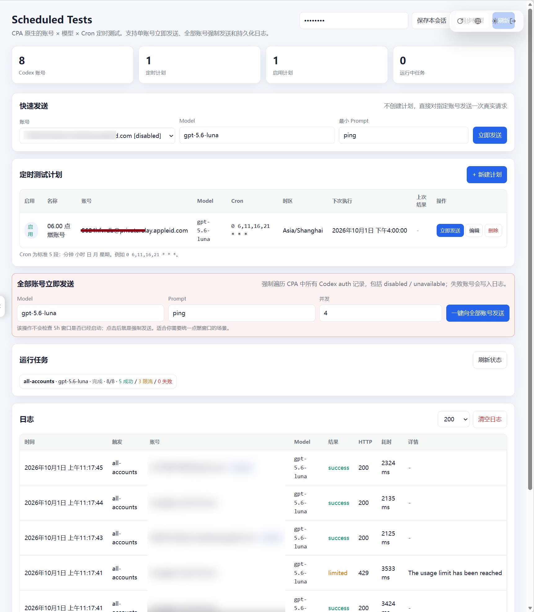

# CPA Scheduled Tests

上级索引：[README.md](README.md)。

## 界面截图



截图来自早期界面；当前版本另有“一键添加全部账号”和 GitHub / Star 入口。

一个原生 CLIProxyAPI（CPA）插件，按 Sub2API Scheduled Tests 的思路提供：

- **账号 + Model + Cron** 的定时测试计划；
- **一键为全部 Codex 账号创建定时计划**：统一指定 Model、Cron、时区和 Prompt，自动一账号一计划，并跳过完全重复计划；
- 每个计划的 **立即发送**；
- 独立的 **快速发送**（指定账号 + Model）；
- **一键向全部 Codex 账号发送**，遍历 `host.auth.list` 中的所有 Codex auth 记录，不因 `disabled` / `unavailable` 字段而跳过；
- JSONL 持久化日志：时间、触发方式、账号、Model、HTTP 状态、延迟、错误分类；
- 全部功能运行在 CPA 进程内，无需 Windows Task Scheduler、PowerShell 常驻或外部服务。

## 重要说明

“全部账号立即发送”是**强制真实请求**，不会判断该账号的 5 小时窗口是否已经开启，因此会产生极小的真实模型请求消耗。对于 `disabled` / `unavailable` 的 auth 文件，插件仍会尝试读取凭据并请求；若 token 已失效，会记录 `auth_error`，不会偷偷修改 CPA 账号状态。

当前 v0.1.3 专门面向 **Codex / ChatGPT OAuth auth**。Model 字段为自由文本；UI 也会通过 CPA 的 `model-definitions/codex` 自动同步当前模型列表作为下拉建议。

## UI

安装后在 CPA Management Center 侧栏打开：

**Scheduled Tests**

或者直接访问：

```text
http://127.0.0.1:8317/v0/resource/plugins/cpa-scheduled-tests/panel
```

资源页面本身不携带敏感数据。首次打开请输入 CPA Management Key；它只保存到当前浏览器标签页的 `sessionStorage`。

## Cron

使用标准 5 段数字 Cron：

```text
分钟 小时 日 月 星期
```

示例：

```text
0 6,11,16,21 * * *
```

代表每天 06:00、11:00、16:00、21:00。

支持：

- `*`
- `*/5`
- `1,2,3`
- `1-5`
- `1-10/2`

星期使用 `0-7`，其中 `0` 和 `7` 都代表星期日。

## 安装配置

CPA `config.yaml`：

```yaml
plugins:
  enabled: true
  dir: plugins
  configs:
    cpa-scheduled-tests:
      enabled: true
      priority: 1
```

Windows x64 DLL 放到：

```text
plugins/windows/amd64/cpa-scheduled-tests.dll
```

也可以直接放：

```text
plugins/cpa-scheduled-tests.dll
```

然后完整重启 CPA。


## Windows 一键构建并安装

源码包附带 `install-windows.ps1`。它不会常驻，也不负责定时任务；它只在第一次安装/升级时下载便携 Go + Zig、编译 CPA 原生 DLL，并复制到 CPA 插件目录。插件安装完成后所有调度都在 CPA 进程内运行。

例如 CPA 在 `D:\Program Files\CLIProxyAPI`：

```powershell
Set-ExecutionPolicy -Scope Process Bypass
.\install-windows.ps1 -CpaDir 'D:\Program Files\CLIProxyAPI'
```

如果同时提供 Management Key，脚本会尝试通过 CPA Management API 自动创建/启用插件配置：

```powershell
.\install-windows.ps1 `
  -CpaDir 'D:\Program Files\CLIProxyAPI' `
  -BaseUrl 'http://127.0.0.1:8317' `
  -ManagementKey '你的ManagementKey'
```

安装后完整重启一次 CPA，然后在侧栏进入 **Scheduled Tests**。

## 数据位置

插件优先写入 CPA 提供的插件目录下 `.data/cpa-scheduled-tests/`；如果该目录不可写（例如受保护的 Program Files），自动回退到用户配置目录中的 `CLIProxyAPI/plugin-data/cpa-scheduled-tests/`。具体实际路径会显示在插件状态数据中。

主要文件：

```text
state.json
runs.jsonl
```

其中：

- `state.json`：计划和 UI 设置；
- `runs.jsonl`：持久化运行日志。

不会写入 OAuth token、Access Token 或完整上游响应。

## Management API

均位于 `/v0/management` 下，需要 CPA Management Key。

```text
GET  /plugins/cpa-scheduled-tests/state
POST /plugins/cpa-scheduled-tests/plans/save
POST /plugins/cpa-scheduled-tests/plans/bulk-create
POST /plugins/cpa-scheduled-tests/plans/delete
POST /plugins/cpa-scheduled-tests/settings
POST /plugins/cpa-scheduled-tests/run
POST /plugins/cpa-scheduled-tests/run-all
GET  /plugins/cpa-scheduled-tests/logs?limit=200
POST /plugins/cpa-scheduled-tests/logs/clear
```

## Windows 构建

此插件只依赖 Go 标准库，但 CPA 原生动态库需要 CGO。

在 Windows PowerShell 中：

```powershell
.\build-windows.ps1
```

要求：

- Go 1.23+；
- 一个可用的 C 编译器（推荐 MSYS2 UCRT64 / MinGW-w64）。

输出：

```text
dist\cpa-scheduled-tests.dll
dist\cpa-scheduled-tests_0.1.3_windows_amd64.zip
```

## 安全设计

- 敏感动作全部放在 CPA Management API 路由后面；
- Resource UI 不直接暴露 auth JSON；
- 不记录 token、原始 auth 文件或完整请求体；
- `host.http.do` 由 CPA 宿主执行出站请求，从而复用 CPA 的宿主网络/代理策略；
- 插件不会自动启用、禁用、恢复或修改任何 CPA auth 文件。
